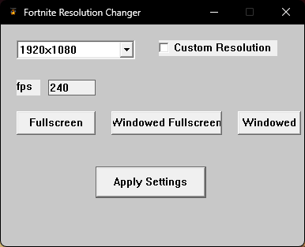
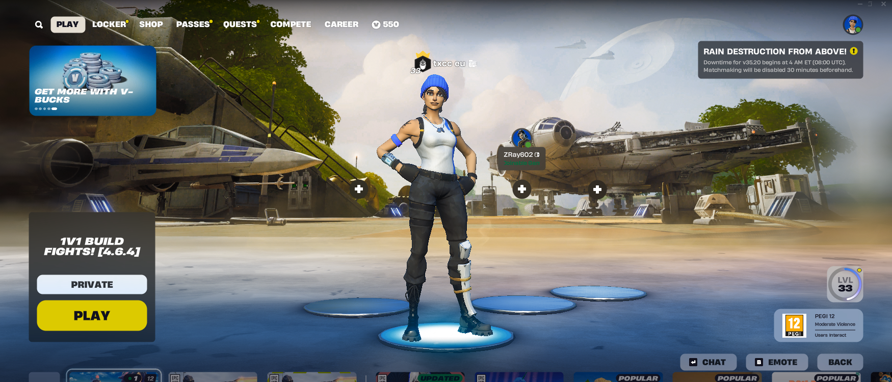

# 🎯 Fortnite Resolution Changer

A fast, user-friendly Windows desktop app that lets you change your **Fortnite resolution** instantly—no need to dig through config files manually.

[](https://github.com/txcceuu/Fortnite-Resolution-Changer/stargazers)
[](LICENSE)


---

## 🚀 Why Use This?

Manually changing Fortnite's resolution requires navigating to a config file buried deep in the file system and editing multiple settings.
This tool automates that process with a simple GUI:

* 🔎 Automatically locates your `GameUserSettings.ini`
* 📝 Edits all resolution-related fields correctly
* ✅ No technical knowledge required

---

## 📸 Screenshots

| Home Screen                      | After Resolution Change             |
| -------------------------------- | ----------------------------------- |
|  |  |

---

## 📅 Installation

### 🔹 Download Release (Recommended)

1. Go to the [Releases Page](https://github.com/txcceuu/Fortnite-Resolution-Changer/releases)
2. Download the latest `.zip` file
3. Extract it anywhere
4. Run `FortniteResolutionChanger.exe`

---

### 🔧 Build from Source

#### Prerequisites:

* Visual Studio 2022
* C++ Desktop Development workload

#### Steps:

```bash
git clone https://github.com/txcceuu/Fortnite-Resolution-Changer.git
```

1. Open the solution in **Visual Studio 2022**
2. Ensure `main.cpp` is added to the project
3. In **Project Properties**:

   * Set **Configuration Type** to `Application (.exe)`
   * Set **Character Set** to `Use Multi-Byte Character Set`
4. Build the solution (`Ctrl + Shift + B`)
5. Run the `.exe` from `x64/Release` or `x64/Debug`

---

## ⚠️ Disclaimer

Because this app modifies configuration files:

- **Browsers may block the download** of the app due to lack of a trusted publisher or code signing.
- **Windows SmartScreen may flag the app** as "unknown" on first run since it's not from a verified developer.
- **Antivirus software may show a false positive** because the app accesses local files and isn't widely distributed.

These warnings are normal for indie apps and do not indicate any malicious behavior.
If you downloaded the `.exe` from the official [GitHub Releases](https://github.com/txcceuu/Fortnite-Resolution-Changer/releases), it is safe to use.

---

## 🧭 How to Bypass Windows SmartScreen

When you first launch `FortniteResChangerGUI.exe`, Windows may show the following warning:

> **"Windows protected your PC"**  
> Microsoft Defender SmartScreen prevented an unrecognized app from starting.

This is a **common and safe** warning for newly released or unsigned apps.

### ✅ How to Run the App Anyway

1. On the warning screen, click **More info**
2. You will now see:
   - The app name: `FortniteResChangerGUI.exe`
   - Publisher: *Unknown publisher*
3. Click the **Run anyway** button
4. The application will launch normally

### 🔒 Why SmartScreen Shows This

- The app is new and hasn't built up enough reputation with Microsoft yet
- It's not digitally signed with a verified certificate (common for open-source or hobby projects)

**If you downloaded the app from the official [GitHub Releases page](https://github.com/txcceuu/Fortnite-Resolution-Changer/releases), it's safe to use.**

---

## 🛣️ Roadmap

This section outlines planned features and improvements for the Fortnite Resolution Changer project. ✅ = Completed, ⏳ = In progress, ❌ = Not started.

    ✅ Read and write to GameUserSettings.ini

    ✅ Basic input validation (positive integers only)

    ✅ Automatically set FullscreenMode and LastConfirmedFullscreenMode to fullscreen

    ✅ Add dropdowns for common resolutions (e.g., 1920x1080, 1280x720)

    ❌ Add a config backup/restore feature

    ❌ Auto-detect Fortnite executable and show status

    ❌ Dark mode UI theme support

    ❌ Multi-language (i18n) support

    ❌ Optional CLI version for command-line power users

    ❌ Add system tray integration

---

## 📝 License

This project is licensed under the [MIT License](LICENSE).

---

## 🤝 Contributing

Suggestions, issues, and contributions are welcome!
Open an [issue](https://github.com/txcceuu/Fortnite-Resolution-Changer/issues) or submit a pull request.

---

## ✨ Author

Created by [@txcceuu](https://github.com/txcceuu)

Enjoy smoother Fortnite tweaking!
